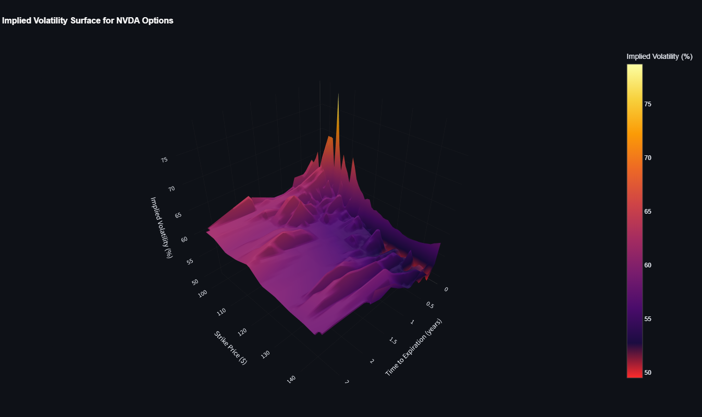
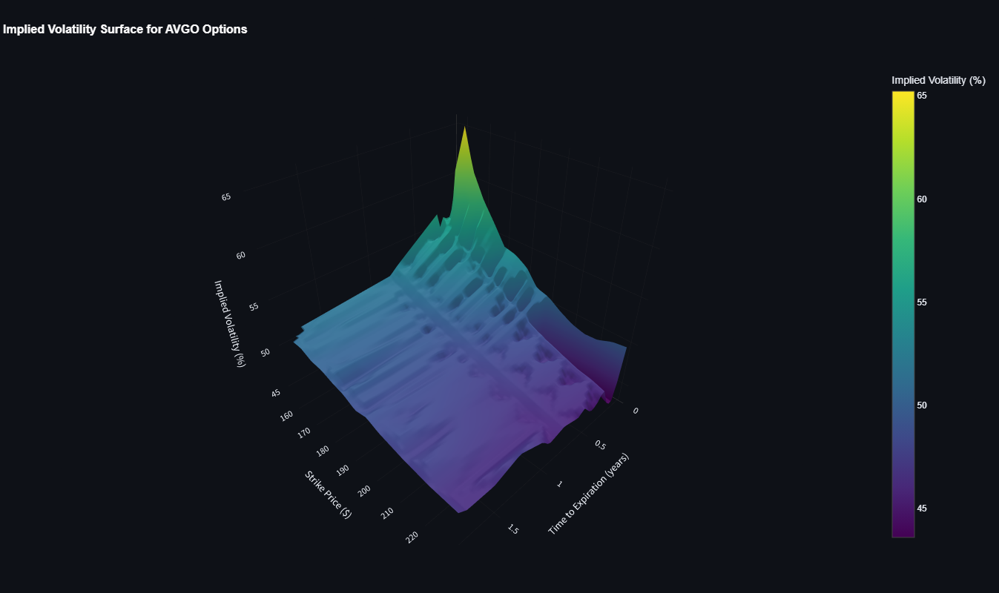
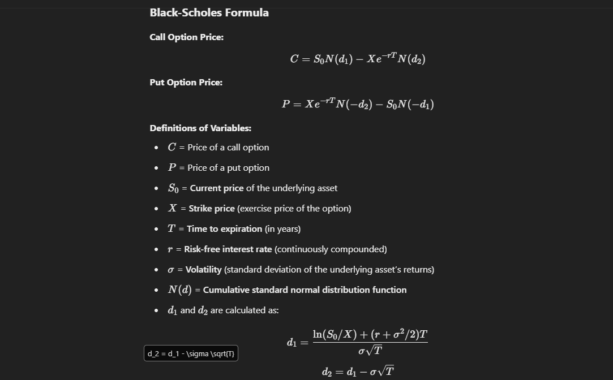

# Black-Scholes Implied Volatility Surface 
A streamlit app consisting of the Black-Scholes Model for displaying Implied Volatility surfaces. 







## Features

- **Live Volatility Surface View**: View the current implied volatility surface for any ticker
- **Historical Data Collection**: Automatically collect and store volatility surface data at configurable intervals
- **Historical Replay**: View how volatility surfaces have evolved over time with animation capabilities
- **Ticker Management**: Configure which tickers to track and manage data collection settings


### Installation

#### Option 1: Local Installation (use a venv)

1. Install dependencies:
   ```
   pip install -r requirements.txt
   ```
2. Create a `.env` file based on `.env.example`:
   ```
   cp .env.example .env
   ```

#### Option 2: Docker Installation

1. Clone this repository
2. Build and run with Docker Compose:
   ```
   docker-compose up -d
   ```

## Running the Application

### Option 1: Using the run.py script 

The easiest way to run the application is to use the `run.py` script, which will start both the data collection server and the Streamlit UI:

# Run the application
python run.py
```

You can also run only the server or only the UI:

```bash
# Run only the data collection server
python run.py --server-only

# Run only the Streamlit UI
python run.py --ui-only
```

### Option 2: Running components separately

If you prefer to run the components separately, you can do so:

1. Start the data collection server:
```bash
source venv/bin/activate
python -m utils.server
```

2. In a separate terminal, start the Streamlit UI:
```bash
source venv/bin/activate
streamlit run main.py
```

### Option 3: Using Docker

If you're using Docker, both the web interface and data collection server will start automatically. Access the web interface at:

```
http://localhost:8501
```

## Configuration

Edit the `.env` file (or environment variables in docker-compose.yml) to configure:

- `DATABASE_URL`: Database connection string (SQLite)
- `SNAPSHOT_INTERVAL_MINUTES`: How often to collect data (default: 60 minutes)
- `RISK_FREE_RATE`: Default risk-free rate for Black-Scholes model
- `DIVIDEND_YIELD`: Default dividend yield for Black-Scholes model
- `MIN_STRIKE_PCT`: Default minimum strike price as percentage of spot price
- `MAX_STRIKE_PCT`: Default maximum strike price as percentage of spot price


## Deployment

For production deployment, consider:

1. Setting up the data collection server as a systemd service or using Docker
2. Deploying the web interface behind a reverse proxy

### Docker Deployment

The included Docker configuration provides a simple way to deploy the application:

1. Adjust environment variables in `docker-compose.yml`
2. Deploy to your server:
   ```
   docker-compose up -d
   ```
3. For persistence, the SQLite database is mounted as a volume

## License

MIT

## Author

rynn | rynn@zhng.dev 
# Modified on 2024-11-20 00:00:00

# Modified on 2024-11-24 00:00:00

# Modified on 2024-11-26 00:00:00

# Modified on 2024-11-30 00:00:00

# Modified on 2024-12-13 00:00:00

# Modified on 2024-12-17 00:00:00
